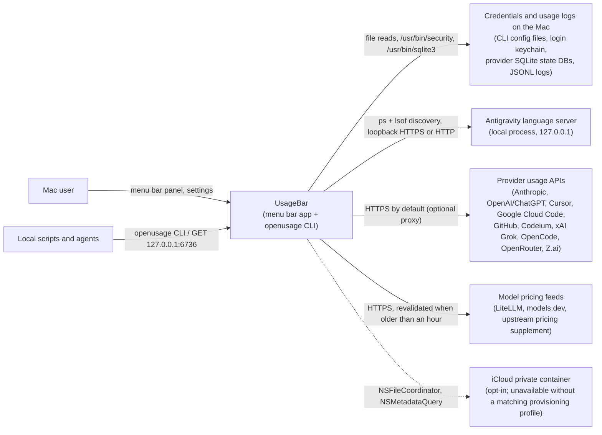

# C4 model: UsageBar (usagebar-no-tel)

Purpose: architecture source of truth for this fork. Read it before an architecture change, and
update it (plus the change log at the bottom) for every change to containers, components, external
systems or data flows. The inherited upstream guide, [architecture.md](architecture.md), still
describes the same code under the name OpenUsage and is kept for reference.

Status: current. Last updated 27 Sep 2026. Written from the Swift source on `no-telemetry` at commit
`6fd60f9`. Every path below is relative to the repo root.

## 1. System context

UsageBar is a macOS 15+ menu bar app that shows how much of each AI coding subscription the user
has used. It reads credentials and usage logs that the provider tools already left on the Mac, calls
the provider's own usage API with them where one is available, and renders the normalized result
in a menu bar panel.

External systems the code calls, and where:

| System | How | Code |
|---|---|---|
| Provider usage APIs (per-provider hosts in section 4) | HTTPS to the default hosts via `URLSessionHTTPClient` (some hosts can be overridden by environment variables, see section 4); optional SOCKS5/HTTP(S) proxy read once from `~/.openusage/config.json` | `Sources/OpenUsage/Services/HTTPClient.swift`, `Sources/OpenUsage/Services/ProxyConfig.swift`, `Sources/OpenUsage/Providers/*/*UsageClient.swift` |
| Local credentials | File reads; keychain via `/usr/bin/security` and the Security framework; SQLite via `/usr/bin/sqlite3`; environment variables, including ones captured from the user's login shell | `Sources/OpenUsage/Services/SystemClients.swift`, `Sources/OpenUsage/Services/LoginShellEnvironment.swift`, `Sources/OpenUsage/Providers/*/*AuthStore.swift` |
| Local usage logs of coding agents | Incremental JSONL scans (Claude Code, Codex, Grok, pi); SQLite queries (OpenCode); conversation DB scan (Antigravity CLI) | `Sources/OpenUsage/Providers/IncrementalJSONLScanner.swift`, `Sources/OpenUsage/Providers/*/*Scanner.swift` |
| Antigravity language server | Finds the running `language_server` or `agy` process with `/bin/ps` and `lsof`, then calls its Connect-RPC service on `127.0.0.1`. For each listening port it tries HTTPS (self-signed) then HTTP, then the HTTP extension port if one was found. `language_server` is called with the `--csrf_token` value from its arguments; `agy` is probed with no CSRF flag | `Sources/OpenUsage/Services/LanguageServerDiscovery.swift`, `Sources/OpenUsage/Providers/Antigravity/AntigravityUsageClient.swift` |
| Model pricing feeds | HTTPS fetch, started in the background by `ModelPricingStore.current()` when a source was last fetched more than an hour ago (30 minutes after a failure), of `raw.githubusercontent.com/BerriAI/litellm/.../model_prices_and_context_window.json`, `models.dev/api.json` and `robinebers.github.io/openusage/pricing_supplement.json`; bundled snapshots in `Sources/OpenUsage/Resources/` cover first launch and offline use | `Sources/OpenUsage/Pricing/ModelPricingStore.swift` |
| iCloud private container | Opt-in "Sync Across Macs"; one coordinated history file per Mac. `script/build_and_run.sh` warns that sync is unavailable when no matching iCloud provisioning profile is installed, as recorded for the fork's documented local build (`docs/plans/2026-09-01-1447_strip-posthog-telemetry-local-build.md`) | `Sources/OpenUsage/Stores/ICloudUsageSyncStore.swift` |
| macOS services | `NSStatusItem` menu bar item, `UNUserNotificationCenter` quota alerts, `SMAppService` launch at login, a runtime-resolved window server symbol for screen-share detection | `Sources/OpenUsage/App/StatusItemController.swift`, `Sources/OpenUsage/Support/AppNotifications.swift`, `Sources/OpenUsage/Stores/LaunchAtLoginSetting.swift`, `Sources/OpenUsage/Services/ScreenCaptureProbe.swift` |

Linked but not contacted by this fork's build:

- PostHog. The SDK is still a dependency (`Package.swift`), but `TelemetryConfig.token` always
  returns the `phc_REPLACE_ME` placeholder, so `PostHogTelemetrySink.init` returns before
  `PostHogSDK.shared.setup()` and every sink method returns early
  (`Sources/OpenUsage/Services/Telemetry.swift`).
- Sparkle update feed. `UpdaterController.start()` returns early when the bundle has no `SUFeedURL`
  (`Sources/OpenUsage/App/UpdaterController.swift`), and `script/build_and_run.sh` writes no
  `SUFeedURL`. The inherited `script/release.sh` does write one; this fork does not use it.

## 2. Containers

| Container | SwiftPM target (product) | Path | Responsibility |
|---|---|---|---|
| Menu bar app | `OpenUsageApp` (executable `OpenUsage`) | `Sources/OpenUsageApp/OpenUsageApp.swift` | SwiftUI `App` whose `AppDelegate` (`Sources/OpenUsage/App/OpenUsageApp.swift`) boots everything. `script/build_and_run.sh` stages it as `dist/UsageBar.app`, bundle id `io.github.omar16100.usagebar` |
| Shared module | `OpenUsage` (library target) | `Sources/OpenUsage/` | Providers, stores, services, pricing, SwiftUI views. Both executables import it |
| CLI | `OpenUsageCLI` (executable `openusage-cli`) | `Sources/OpenUsageCLI/` | One-shot JSON read of usage. Bundled as `Contents/Helpers/openusage`; Settings can symlink it to `/usr/local/bin/openusage` (`Sources/OpenUsage/Services/CommandLineToolInstaller.swift`) |
| Local HTTP API | in-process, started by `AppContainer` | `Sources/OpenUsage/Services/LocalUsageServer.swift`, `LocalUsageAPI.swift`, `LocalLimitsAPI.swift` | Read-only `GET /v1/usage`, `/v1/usage/<id>`, `/v1/limits`, `/v1/limits/<id>` on `127.0.0.1:6736`; silently off if the port is taken |
| Local state | files, defaults, keychain | see below | Persistence between launches |

Local state written by the app:

- Standard `UserDefaults` for the app's bundle id: settings, layout (`openusage.layout.v1`), and the
  `ProviderSnapshotCache` blob that the CLI also reads.
- `UserDefaults` suite `<bundle id>.telemetry`: install id, optional-analytics flag, daily counters
  (`Sources/OpenUsage/Stores/TelemetryStore.swift`). Still written in this fork, never sent.
- `~/Library/Application Support/OpenUsage/`: `pricing/` cache, `log-scan-cache/`, the Antigravity
  token cache `antigravity/auth.json`, and the single-instance `<bundle id>.lock`.
- `~/Library/Logs/UsageBar/UsageBar.log` (`Sources/OpenUsage/Support/LogFile.swift`).
- Rotated OAuth tokens written back to where they were read (Claude, Codex, Cursor, Grok), and
  user-entered API keys for OpenRouter and Z.ai written to
  `~/.config/openusage/openrouter.json` and `~/.config/openusage/zai.json`
  (`Sources/OpenUsage/Providers/UserAPIKeyStore.swift`).

Tests: `Tests/OpenUsageTests` (module) and `Tests/OpenUsageCLITests` (CLI).

## 3. Components

`Sources/OpenUsage/`, grouped by folder.

App/
- `AppDelegate` (`App/OpenUsageApp.swift`): launch order is `AppLog.bootstrap`, `SingleInstanceLock`,
  `SettingsMigrator`, `LegacyLaunchAgentCleanup`, `AppearanceSetting.applyCurrent()`, then
  `AppContainer`, `StatusItemController` and `UpdaterController.start()`. It waits for the
  login-shell environment capture first only when there is neither a saved shell snapshot nor a
  successful capture; otherwise `AppContainer` prewarms the capture in the background.
- `AppContainer`: composition root. Builds providers from `ProviderCatalog`, the `WidgetRegistry`,
  every store, `CodexResetClaimService`, `TelemetryRecorder` and `LocalUsageServer`, and runs the
  periodic refresh loop.
- `StatusItemController` + `StatusItemImageUpdater`: the `NSStatusItem`, the key-capable
  `MenuBarPanel` (`NSPanel`) hosting `DashboardView`, and the global shortcut (KeyboardShortcuts).
- `UpdaterController`: Sparkle wrapper, dormant in this fork (section 1).

Providers/
- `ProviderRuntime`: protocol with `refresh()` (returns a `ProviderSnapshot`) and
  `hasLocalCredentials()` (local-only probe for first-run seeding).
- `ProviderCatalog.make`: the installed set, in order: Claude (one card per account), Codex, Cursor,
  Antigravity, Copilot, Devin, Grok, OpenCode, OpenRouter, Z.ai.
- One folder per provider, each with an auth store, a usage client and a mapper to `MetricLine`.
- Shared: `IncrementalJSONLScanner` + `JSONLScanCacheStore` (cached JSONL parsing), `Pi/PiUsageScanner`
  (pi agent sessions attributed to Claude and Codex), `DefaultAccountObserver`, and
  `Services/ProviderAccountAssembly` (multi-account Claude cards).
- `Codex/CodexResetClaimService`: claims Codex rate-limit reset credits. The only provider-API write.

Stores/
- `WidgetDataStore`: per-provider refresh returning a `RefreshOutcome` (`.refreshed`, `.cacheHit`,
  `.backedOff`, `.failed`, `.skipped`), failure backoff, last-good snapshots.
- `ProviderSnapshotCache`: snapshots persisted in `UserDefaults`. In the app, a snapshot counts as
  fresh only if it was written this session and is younger than `RefreshSetting.interval`
  (5 minutes); accepted snapshots loaded from disk at launch are shown until the first pass
  refreshes them. The CLI opts into timestamp-only freshness (`allowsPersistedFreshness`). For a
  card whose current account identity is known, an entry whose stamp is missing or names another
  account (`hasStaleAccountStamp`) is neither shown at launch nor served as fresh, in the app or the
  CLI; a card with an unresolved identity keeps its entry.
- `LayoutStore`, `ProviderEnablementStore`, `NotificationSettingsStore`, `MenuBarPrivacyStore`,
  `PopoverNavigationStore` (screens: dashboard, customize, settings).
- `ICloudUsageSyncStore`: opt-in history sync.
- `TelemetryRecorder` + `TelemetryStore`: daily rollup bookkeeping; the sink is inert here.

Services/
- `HTTPClient` (`URLSessionHTTPClient`), `ProxyConfig`, `SystemClients` (files, keychain, sqlite3),
  `ProcessRunner`, `LoginShellEnvironment`, `LanguageServerDiscovery`.
- `LocalUsageServer` / `LocalUsageAPI` / `LocalLimitsAPI`: the loopback API.
- `UsageReader`: the CLI's entry into the same cache and refresh engine.
- `Telemetry.swift`: `TelemetryConfig` and `PostHogTelemetrySink`.

Pricing/
- `ModelPricingStore`: bundled snapshots + disk cache + stale-while-revalidate refresh (a source is
  due one hour after its last success, 30 minutes after a failure).
  Used to price tokens into spend for Claude, Codex, Cursor, Grok and Antigravity.

Views/ and Support/
- SwiftUI screens: `DashboardView`, `CustomizeView`, `SettingsScreen`.
- `AppLog`, `LogFile`, `LogRedaction`: file and unified logging with secrets redacted.

## 4. Providers

Credential sources and hosts as written in each provider folder under `Sources/OpenUsage/Providers/`.

| Provider | Credentials read from | Remote hosts | Local usage history |
|---|---|---|---|
| Claude | `~/.claude/.credentials.json` or `$CLAUDE_CONFIG_DIR`; keychain `Claude Code-credentials` (suffixed variants for non-default homes or OAuth endpoints); `CLAUDE_CODE_OAUTH_TOKEN` (no live usage call with this token, local history only); Claude Desktop (keychain `Claude Safe Storage` plus files under `~/Library/Application Support/Claude/`) | Defaults `api.anthropic.com` and `platform.claude.com` (token refresh); `CLAUDE_CODE_CUSTOM_OAUTH_URL` and staging/local switches can override them (`ClaudeAuthStore.resolveOAuthEndpoints`) | JSONL under `~/.claude` and `$XDG_CONFIG_HOME/claude` (or `$CLAUDE_CONFIG_DIR`), Cowork sessions under `~/Library/Application Support/Claude/local-agent-mode-sessions`, plus pi sessions |
| Codex | `auth.json` in `$CODEX_HOME`, `~/.config/codex` or `~/.codex`; keychain `Codex Auth` | `chatgpt.com/backend-api/wham/...`, `auth.openai.com` (token refresh) | `sessions/` and `archived_sessions/` JSONL under `$CODEX_HOME` or `~/.codex`, plus pi sessions |
| Cursor | Cursor's `state.vscdb` (via sqlite3); keychain `cursor-access-token`, `cursor-refresh-token` | `api2.cursor.sh`, `cursor.com/api/...` (includes the usage CSV export) | none on disk |
| Antigravity | Local language server: `--csrf_token` from the running `language_server` process's arguments (none for `agy`). Cloud fallback: keychain `gemini` (account `antigravity`) plus own token cache under Application Support | Local language server first; then `daily-cloudcode-pa.googleapis.com`, `cloudcode-pa.googleapis.com`, `oauth2.googleapis.com` | `~/.gemini/antigravity-cli/conversations` |
| Copilot | `~/.config/github-copilot/apps.json` and `hosts.json`, `~/.config/gh/hosts.yml`, keychain `gh:github.com` | `api.github.com` | none |
| Devin | `~/.local/share/devin/credentials.toml`, Devin's `state.vscdb` | `server.codeium.com` by default | none |
| Grok | `~/.grok/auth.json` | `cli-chat-proxy.grok.com`, `auth.x.ai` | JSONL under `$GROK_HOME` or `~/.grok` |
| OpenCode | `auth.json` (`opencode-go` key) in the OpenCode data dir | `opencode.ai`, only when the `opencode-go` key exists | `opencode*.db` in `~/.local/share/opencode` (or `$OPENCODE_DATA_DIR`, `$XDG_DATA_HOME/opencode`) |
| OpenRouter | `~/.config/openusage/openrouter.json`, `~/.config/openrouter/key.json`, `OPENROUTER_API_KEY`, `OPENROUTER_KEY` | `openrouter.ai` | none |
| Z.ai | `~/.config/openusage/zai.json`, `~/.config/zai/key.json`, `ZAI_API_KEY`, `GLM_API_KEY` | `api.z.ai` | none |

## 5. Key data flows

1. Periodic refresh. `AppContainer.startPeriodicRefresh` loops: `WidgetDataStore.refreshAll()`, then
   `evaluateNotifications()`, then `TelemetryRecorder.tick()`, then sleep until
   `RefreshSetting.interval` or an early wake from `RefreshWakeSignal` (provider enable/disable).
2. One provider refresh. Unless forced, `WidgetDataStore.refresh` serves a fresh cached snapshot
   (`.cacheHit`) and skips a provider still in failure backoff (`.backedOff`); a forced refresh
   bypasses both. Otherwise the provider's `refresh()` loads credentials off the main actor
   (`loadOffMainActor`), may call its API through `HTTPClient` (subject to what the credentials
   allow and provider-specific rules such as Claude's rate-limit cooldown), optionally scans local logs and prices tokens through `ModelPricingStore`, and maps the result to
   a `ProviderSnapshot`.
   On success the store updates `ProviderSnapshotCache`; on failure it keeps the last good snapshot
   and shows the error.
3. Rendering. `@Observable` stores drive `DashboardView` inside the panel and the menu bar strip
   (`MenuBarStripRenderer`), which is swapped for a plain label while the screen is shared if that
   setting is on.
4. Local API. `LocalUsageServer` answers loopback `GET` requests from the in-memory snapshots,
   enabled order and provider errors that `AppContainer` passes in.
5. CLI. `openusage` finds its containing app's bundle id (or `OPENUSAGE_DEFAULTS_SUITE`), opens that
   defaults domain, and `UsageReader` prints JSON from `ProviderSnapshotCache`. It refreshes
   in-process through the same `ProviderCatalog` and `WidgetDataStore` when `--force` is passed or
   a requested (or, with no argument, enabled) provider has no fresh entry or an entry stamped with
   a different account. It never launches the GUI.
6. Telemetry, as it runs here. `TelemetryRecorder` still keeps its bookkeeping in the telemetry
   suite (the daily active day always, refresh outcome counters while the optional-analytics toggle
   is on, which is the default), but its `PostHogTelemetrySink` is unconfigured, so
   `capture` and `flush` do nothing and no request leaves the Mac.

## 6. Divergence from upstream

Upstream is [robinebers/openusage](https://github.com/robinebers/openusage). GitHub does not list
this repo as a fork (`gh repo view` returned no parent on 27 Sep 2026). It was branched from upstream
tag `v0.7.10` (commit `05c40a1`) and adds five commits. `git diff v0.7.10 no-telemetry` touches 44 files (511 insertions, 288 deletions), so
the divergence is wider than `Telemetry.swift`:

| Change | Files |
|---|---|
| Telemetry strip: no baked PostHog token, `OPENUSAGE_POSTHOG_TOKEN` override removed | `Sources/OpenUsage/Services/Telemetry.swift`; two new tests in `Tests/OpenUsageTests/TelemetrySinkTests.swift` |
| Rebrand to UsageBar per upstream `TRADEMARK.md`: display strings, outbound `User-Agent: UsageBar` (Codex, Copilot org billing and Grok clients), unified-log subsystem, log path | 20 other files under `Sources/` (including `OpenUsageCLI.swift`); `Tests/OpenUsageTests/GrokProviderTests.swift` and `LogFileTests.swift` updated to match |
| Build identity: app name `UsageBar`, bundle id `io.github.omar16100.usagebar`, iCloud container id | `script/build_and_run.sh` |
| App icon assets and screenshot removed | `assets/AppIcon.icon/`, `assets/AppIcon.prebuilt/`, `assets/screenshot.jpg` (deleted). The same gauge glyph as the deleted `AppIcon.icon/Assets/dashboard-3-line.svg` (identical path data) is still bundled as `Sources/OpenUsage/Resources/ProviderIcons/openusage.svg` and drawn by `MenuBarIcon`, the screen-share label in `MenuBarStripRenderer` and `ShareCardChrome` |
| Dependabot config removed | `.github/dependabot.yml` (deleted) |
| Fork docs | `README.md` replaced; `docs/fork-maintenance.md` and `docs/plans/` added; `docs/privacy.md` rewritten; `docs/README.md`, `debugging.md`, `icloud-sync.md`, `logging.md`, `settings.md`, `updates.md` and `research/account-first-plan.md` edited for the new name, log path or fork notices |

Unchanged from upstream, and easy to mistake for fork work: SwiftPM package, target and binary
names (`OpenUsage`, `openusage-cli`, helper `openusage`), `Package.swift` dependencies (PostHog and
Sparkle are still linked), the `~/Library/Application Support/OpenUsage/`, `~/.openusage/` and
`~/.config/openusage/` paths, the pricing supplement URL on upstream's GitHub Pages, the CLI's
unbundled fallback defaults suite `com.robinebers.openusage` (`Sources/OpenUsageCLI/AppBundleLocator.swift`),
the `NSUbiquitousContainers` key in the Info.plist that `script/build_and_run.sh` writes
(`iCloud.com.robinebers.openusage.dev`), `script/release.sh`, and the seven workflows in
`.github/workflows/`. GitHub Actions is disabled on this repo (repo Actions permissions returned
`enabled: false` on 27 Sep 2026), so none of those workflows run.

## Change log

| Date | Change |
|---|---|
| 27 Sep 2026 | Created from the source at `6fd60f9`. |
